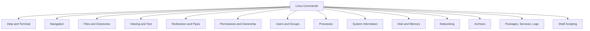

# Improved Linux Command Map

The original image grouped commands into system, file, user, network, and process commands. This version removes the repeated user category and adds important beginner topics.

| Category | Commands |
| --- | --- |
| Help | `man`, `--help`, `apropos`, `history`, `clear` |
| Navigation | `pwd`, `ls`, `cd` |
| Files | `touch`, `mkdir`, `cp`, `mv`, `rm`, `file`, `stat` |
| Viewing | `cat`, `less`, `head`, `tail`, `nano` |
| Search and text | `find`, `grep`, `wc`, `sort`, `uniq`, `cut` |
| Redirection | `>`, `>>`, `<`, `|`, `tee` |
| Permissions | `chmod`, `chown`, `chgrp`, `umask` |
| Users | `whoami`, `id`, `who`, `w`, `groups`, `passwd`, `sudo` |
| Processes | `ps`, `top`, `pgrep`, `kill`, `jobs`, `bg`, `fg` |
| System | `uname`, `hostname`, `uptime`, `date`, `env`, `which` |
| Storage | `df`, `du`, `lsblk`, `free`, `findmnt` |
| Network | `ip`, `ping`, `curl`, `wget`, `ss` |
| Archives | `tar`, `gzip`, `gunzip`, `zip`, `unzip` |
| Software and services | `apt`, `dnf`, `pacman`, `systemctl`, `journalctl` |
| Scripting | variables, tests, conditions, loops, functions |
